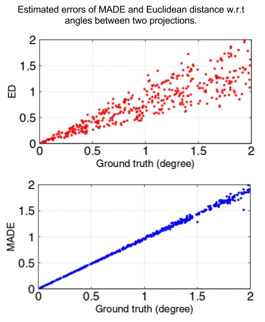

# MADE

**Moments-Based Angular Difference Estimation Between Two Tomographic Projections in 2D and 3D**

**Author**: Minh-Son Phan

## Introduction

MADE method aims at estimating the angular difference between two projections
from a set of projections taken at unknown directions. The problem of unknown-directions projections
is often found in medical imaging when object moves during the acquisition, or in cryo-electron microscopy for object reconstruction. 
the MADE method can be replaced for the Euclidiean distance in the process of tomographic reconstruction.

#### More Detail: Please read this [paper](http://link.springer.com/article/10.1007/s10851-016-0673-5?view=classic).

#### Progamming Language: Matlab (tested for Matlab 2013 and above)

## File structure

    - data : simulated images
    - functions
    - src: source files
    
## Remark

1. We use *parallel computing toolbox* of Matlab to run some steps.
If the toolbox is not available, there is no problem but the running time is much higher.
2. The *displayphantom3d_ver2()* run well for Matlab 2015. For the previous versions, please run *displayphantom3d_ver1()*.

## How to test

1. Suppose the current directory of Matlab is the project directory.
2. Run src/est2d.m to test MADE in 2D case.
3. Run src/est3d.m to test MADE in 3D case.
