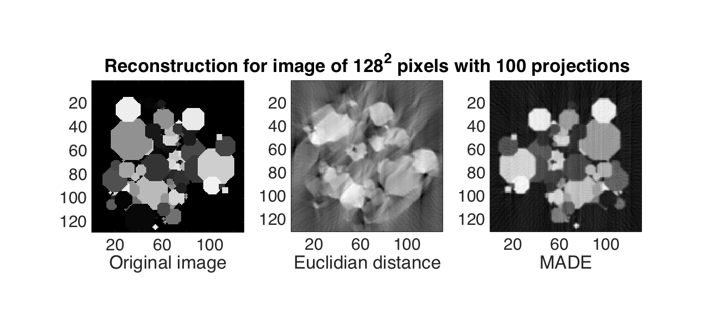
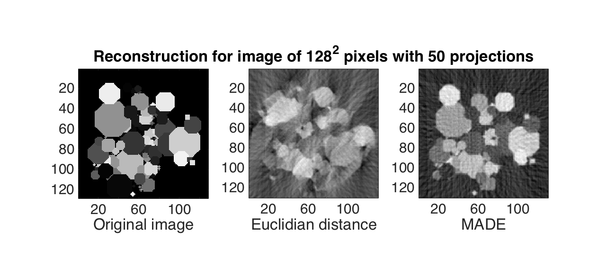

# SphericalMADEReconst

**2D Image Reconstruction using Spherical Multidimensional Scaling and MADE measure**

**Author**: Minh-Son Phan

## Introduction

This project develops a new algorithm for reconstructing a 2D object from a set of its 1D projections. 
The angles of the projections are not known in prior.
The algorithm builds a distance matrix of projections using MADE measure. 
Then the spherical multidimensional scaling (spherical MDS) is used on the distance matrix to estimate the angles of projections.
Finally, the estimated object is reconstructed using filtered-backprojection algorithm.
Please read the papers below for more detail:

1. [MADE measure](http://ieeexplore.ieee.org/xpl/articleDetails.jsp?arnumber=7025348)
2. [Spherical Multidimensional Scaling](http://www.ncbi.nlm.nih.gov/pmc/articles/PMC2898708/)

## Remark 

Tested for Matlab 2013 and above.
 
## How to test

Simply run src1_made2d.m in Matlab.

